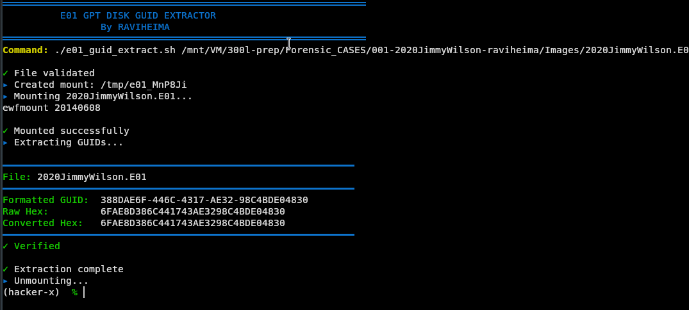

# EnCase Imager Hex GUID Extractor

Forensic scripts for extracting GPT disk and partition GUIDs from E01 (EnCase) image files and converting them to hex format with proper endianness handling.



## Overview

These Bash scripts extract GPT (GUID Partition Table) identifiers from E01 forensic images and display them in multiple formats:
- **Formatted GUID** (Standard UUID format)
- **Raw Hex** (Direct disk storage format)
- **Converted Hex** (Python UUID library conversion with endianness handling)

## Motivation

These scripts were created to solve forensic analysis challenges with the **2020JimmyWilson.E01** forensic image file. Specific questions I needed to answer:

> **The disk GUID (in hex) of the physical disk is: 6FAE8D386C441743AE3298C4BDE04830**  
> Select one: True / False

> **The 2nd partition's unique GUID (in hex) of the physical disk is: 423FDC8AA701EE46AF5A70C06738E819**  
> Select one: True / False

Since EnCase Imager is not readily available on Linux and Autopsy doesn't show GUIDs in raw hex format, I created these lightweight scripts using open-source tools to extract and verify GUIDs directly from E01 images.

## The Endianness Problem

**Both scripts were created specifically because of GUID endianness conversion issues.**

When you extract GUIDs using standard tools like `gdisk` or `sgdisk`, you get formatted UUIDs:
```
Disk identifier (GUID): 388DAE6F-446C-4317-AE32-98C4BDE04830
Partition unique GUID: 8ADC3F42-01A7-46EE-AF5A-70C06738E819
```

But assessment questions expect the raw hex format:
```
Disk GUID: 6FAE8D386C441743AE3298C4BDE04830
Partition GUID: 423FDC8AA701EE46AF5A70C06738E819
```

**Why are they different?**

GUIDs use **mixed endianness**:
- First 3 fields: **little-endian** (bytes reversed)
- Last 2 fields: **big-endian** (normal order)

### Example Conversion

```
Formatted: 8ADC3F42-01A7-46EE-AF5A-70C06738E819
           └──┬───┘ └┬─┘ └┬─┘ └─────┬──────────┘
         Reverse  Rev  Rev      Keep as-is

Raw Hex:   423FDC8A A701 EE46 AF5A70C06738E819
```

Both scripts use Python's `uuid` library to handle this conversion automatically:

```python
import uuid

guid = uuid.UUID('8ADC3F42-01A7-46EE-AF5A-70C06738E819')
raw_hex = guid.bytes_le.hex().upper()
# Result: 423FDC8AA701EE46AF5A70C06738E819
```

## Purpose

- **Class Assessment**: Forensic analysis coursework
- **Educational**: Demonstration of E01 image handling on Linux
- **Time-saving**: AI-assisted development for rapid prototyping
- **Practical**: Alternative to commercial forensic tools

## Scripts

### `e01_guid_extract.sh` - Disk GUID Extractor

Extracts the main disk GUID from E01 images with endianness conversion.

```bash
./e01_guid_extract.sh /path/to/2020JimmyWilson.E01
```

### `e01_partition_guid_extractor.sh` - Partition GUID Extractor

Extracts partition GUIDs, cluster sizes, and partition information with proper endianness conversion.

```bash
./e01_partition_guid_extractor.sh /path/to/2020JimmyWilson.E01
```

## Features

✅ Automatic E01 mounting and cleanup  
✅ Multiple GUID format outputs  
✅ Proper endianness conversion for both disk and partition GUIDs  
✅ Cluster size extraction  
✅ Cross-distribution support (Debian/Ubuntu, Fedora/RHEL, Arch)  
✅ Clean, concise output  
✅ Error handling and automatic unmounting  

## Dependencies

- **ewf-tools** / **libewf** - For mounting E01 images
- **gdisk** / **gptfdisk** - For reading GPT information
- **sleuthkit** - For filesystem analysis (fsstat)
- **python3** - For GUID endianness conversion

## Tested On

- ✅ Fedora (primary development OS)
- ✅ Kali Linux

## Installation

```bash
# Install dependencies
# Fedora
sudo dnf install libewf gdisk sleuthkit python3

# Kali/Ubuntu
sudo apt install ewf-tools gdisk sleuthkit python3

# Clone repository
git clone https://github.com/raviheima/encase-imager-hex-guid-extractor.git
cd encase-imager-hex-guid-extractor

# Make scripts executable
chmod +x e01_guid_extract.sh
chmod +x e01_partition_guid_extractor.sh
```

## Usage

```bash
# Extract disk GUID
./e01_guid_extract.sh /path/to/2020JimmyWilson.E01

# Extract partition GUIDs
./e01_partition_guid_extractor.sh /path/to/2020JimmyWilson.E01
```

## Use Cases

- Answer assessment questions requiring raw hex GUID values
- Extract GUID data not displayed correctly in Autopsy
- Quick forensic analysis without EnCase license
- Educational forensics labs using E01 images

## Notes

- Scripts perform read-only operations (non-destructive)
- Automatic cleanup on exit
- Works with standard forensic images (E01, Ex01, split files)
- Built with AI assistance

## Author

**RaviHeima** - Cybersecurity student using open-source forensic tools on Linux

---

⭐ Star this repo if it helps you with forensic assessments!
